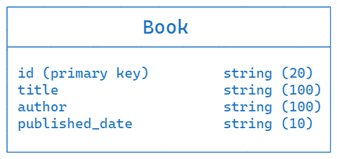
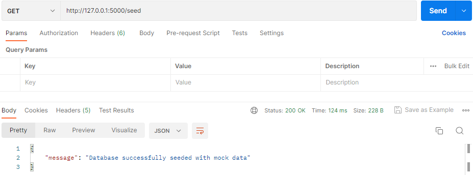

# Building Three API Endpoints with Database Interaction
Language used for backend development: Python (flask framework)

### API Codes used
- 200: OK
- 400: Bad request / Invalid argument (invalid request payload)
- 404: Not found
- 409: Conflict response status code indicates a request conflict with the current state of the target resource
- 502: Bad gateway

### Directory setting
```
project
    |- app.py
    |- db.py
    |- instance
    |   |- library.db
    |- problem_description.txt
    |- README.md
    |- images
        |- database_image.png
        |- new_book_added_1_postman.png
        |- new_book_added_2_postman.png
        |- retrieve_all_books_postman.png
        |- seed_postman.png
        |- update_1_postman.png
        |- update_2_postman.png
```

### Database structure


### Running the Application
Install Flask:
```
pip install Flask
```
Install Flask SQLAlchemy:
```
pip install Flask-SQLAlchemy
```
Run the application:
```
python app.py
```
The application will start running on `http://127.0.0.1:5000/`

### System Architecture To-do lists
```
GET /api/books
    |- Error handling for database connection issues [✓]
    |- Retrieval of all books from the database [✓]

POST /api/books
    |- Error handling for database connection issues [✓]
    |- Proper validation of the request payload [✓]
    |- Appropriate handling of errors, such as duplicate book entries [✓]
    |- Correct insertion of the new book into the database (Checking primary key) [✓]

PUT /api/books/<string:id>
    |- Error handling for database connection issues [✓]
    |- Correct identification and retrieval of the book from the database [✓]
    |- Handling errors, such as updating a non-existent book [✓]
    |- Proper validation of the request payload [✓]
    |- Updating the book details in the database with validity of the property (Checking primary key) [✓]

GET /seed
    |- Assumption: The payload structure will be followed and there will not be any duplicate ID of the books
    |- Checking for the duplication of the book id
    |- Error handling for database connection issues
```

### Seeding the Database with Mock Data
To seed the database with mock data, I have added a separate route in the `app.py` file.

To to seed the database with mock data just send a request to `http://127.0.0.1:5000/seed`

### Endpoint Descriptions
**Retrieve All Books**

- Endpoint: `GET /api/books`
- Response format: 
    ```json
    {
        "books": [
            {"id": "B1", "title": "Book 1", "author": "Author 1", "published_date": "2023-01-01"},
            {"id": "B2", "title": "Book 2", "author": "Author 2", "published_date": "2023-02-01"},
            {"id": "B3", "title": "Book 3", "author": "Author 3", "published_date": "2023-03-01"},
        ]
    }
    ```

**Add a New Book**

- Endpoint: `POST /api/books`
- Request format:
    ```json
    {
        "id": "B4",
        "author": "Author 4",
        "published_date": "2023-01-01",
        "title": "Book 4"
    }
    ```
- Response format:
    ```json
    {
        "message": "Book added successfully"
    }
    ```

**Update Book Details**

- Endpoint: `PUT /api/books/{id}`
- Request format:
    You have to give the information of atleast one of the following keys: `title`, `autho`, `published_date`
    ```json
        {
            "title": "Updated Book Title",
            "author": "Updated Author",
            "published_date": "Updated Publishing Date"
        }
    ```
- Response format:
    ```json
    {
        "message": "Book updated successfully"
    }
    ```

### Testing on Postman
**Seeding Data**


**Retrieve All Books**


**Adding New Book**


**Updating Existing**

